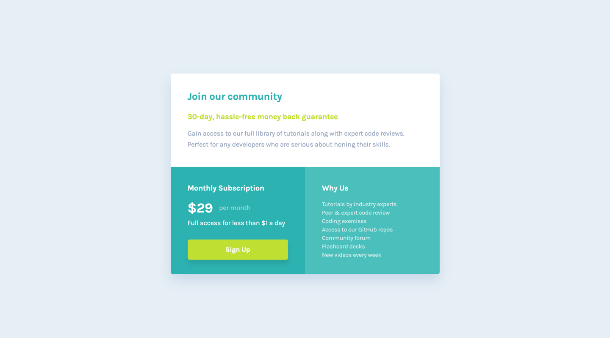

# Frontend Mentor - Single price grid component solution

This is a solution to the [Single price grid component challenge on Frontend Mentor](https://www.frontendmentor.io/challenges/single-price-grid-component-5ce41129d0ff452fec5abbbc). Frontend Mentor challenges help you improve your coding skills by building realistic projects.

## Table of contents

- [Overview](#overview)
  - [The challenge](#the-challenge)
  - [Screenshot](#screenshot)
  - [Links](#links)
- [My process](#my-process)
  - [Built with](#built-with)
- [Author](#author)

## Overview

### The challenge

Users should be able to:

- View the optimal layout for the component depending on their device's screen size
- See a hover state on desktop for the Sign Up call-to-action

### Screenshot
* Desktop

* Mobile

### Links

- Solution URL: [Single Price Grid Component using NextJS](https://www.frontendmentor.io/solutions/single-price-grid-component-using-nextjs-mJ8vGVymW)
- Live Site URL: [Single Price Grid Component](https://single-price-grid-component-hanseonglee.vercel.app)

## My process

### Built with

- Semantic HTML5 markup
- CSS custom properties
- Flexbox
- CSS Grid
- Mobile-first workflow
- [React](https://reactjs.org/) - JS library
- [Next.js](https://nextjs.org/) - React framework
- [Sass/SCSS](https://sass-lang.com/) - For styles

## Author

- Frontend Mentor - [@HanSeongLee](https://www.frontendmentor.io/profile/HanSeongLee)
